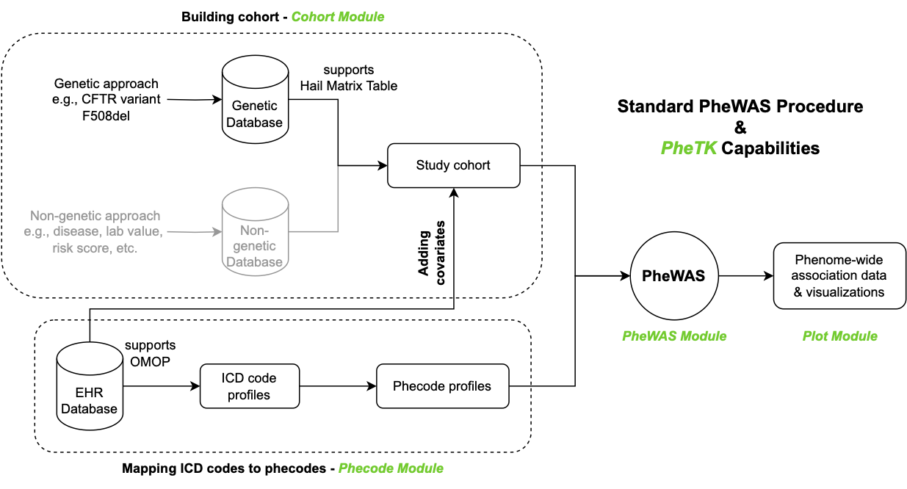

# PheTK - Phenotype Toolkit
The official repository of PheTK.

## Installation
PheTK is available on the Python Package Index (PyPI) and can be installed using pip install command in a terminal:

```
pip install PheTK
```

## Quick PheWAS demo

User can run the quick 1-minute PheWAS demo with the following command in a terminal:

```
python3 -m PheTK.Demo
```

Or in Jupyter Notebook:

```
from PheTK import Demo

Demo.run()
```

## Description
PheTK is a fast and efficient python library for Phenome Wide Association Studies (PheWAS) and other analyses 
utilizing both phecode 1.2 and phecodeX 1.0.

#### PheWAS workflow and PheTK modules


#### PheTK module descriptions
This table will be updated as we update PheTK.

CLI = Command line interface

| Module  | Class   | Method(s)     | Requirements                                                               | CLI |
|---------|---------|---------------|----------------------------------------------------------------------------|-----|
| Cohort  | Cohort  | by_genotype   | Can be used on any platform with Hail Matrix Table.                        | No  |
|         |         | add_covariate | Google BigQuery OMOP database. Currently optimized for All of Us.          | No  |
| Phecode | Phecode | count_phecode | Map ICD code data to phecode 1.2 or phecodeX 1.0.                          | No  |
|         |         |               | Must be instantiated with user's cohort ICD code data for custom platform. |     |
|         |         |               | User can provide their own ICD-to-phecode mapping table.                   |     |
| PheWAS  | PheWAS  | all methods   | Can be run on any platform.                                                | Yes |
| Plot    | Plot    | all methods   | Can be run on any platform.                                                | No  |
| Demo    |         | all methods   | Can be run on any platform.                                                | Yes |


## Usage
As shown in module descriptions, some features of Cohort and Phecode modules are customized to support the data 
structure of the All of Us Research Program. PheWAS and Plot modules can be run on any platform.

### PheWAS module
PheWAS module can be used in both Linux command line interface and Python environment.

#### Command line interface example:
```
python3 -m PheTK.PheWAS \
--phecode_version X \
--cohort_csv_path example_cohort.csv \
--phecode_count_csv_path example_phecode_counts.csv \
--sex_at_birth_col sex \
--covariates age sex pc1 pc2 pc3 
--independent_variable_of_interest independent_variable_of_interest \
--min_case 50 \
--min_phecode_count 2 \
--output_file_name example_phewas_results.csv
```

#### Jupyter Notebook example:
```
from PheTK.PheWAS import PheWAS

example_phewas = PheWAS(
    phecode_version="X",
    phecode_count_csv_path="example_phecode_counts.csv",
    cohort_csv_path="example_cohort.csv",
    sex_at_birth_col="sex",
    covariate_cols=["age", "sex", "pc1", "pc2", "pc3"],
    independent_variable_of_interest="independent_variable_of_interest",
    min_cases=50,
    min_phecode_count=2,
    output_file_name="example_phewas_results.csv"
)
example_phewas.run()
```

## Contact: 

PheTK@mail.nih.gov

## Citation: 

TBD